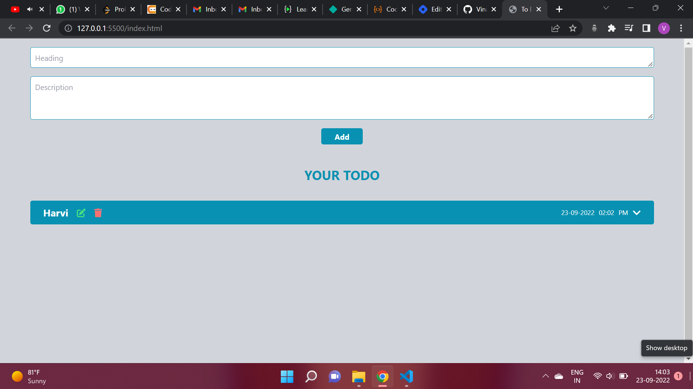

# **ToDo App using JS**
## **Overview**
This is ToDo app in which you can add, edit and delete your tasks by a single click. You can provide Heading and Description of the taks and hit add and will be added. All these data will be stored locally in your browser so that it does not get deleted after being refreshed. The app is completely responsive for all the devices.

## **Technology Used**
1. HTML
2. Tailwind CSS
3. JavaScript

## **Output**

## **Live Link**
